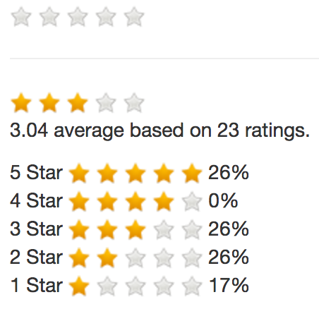

# Camaleon CMS Rating
A star rating plugin for the Camaleon CMS.

## Preview


## Usage
```erb
<!-- including scripts into the layout file -->
<%= javascript_include_tag plugin_asset_path('main', 'camaleon_cms_rating') %>

<!-- including partials into the post template file -->
<%= render partial: plugin_view('front/index', 'camaleon_cms_rating'), locals: { post: @post } %>
<%= render partial: plugin_view('front/new', 'camaleon_cms_rating'), locals: { post: @post } %>
```

## Installation
Add this line to your application's Gemfile:

```ruby
gem 'camaleon_cms_rating'
```

And then execute:
```bash
$ bundle
```

Or install it yourself as:
```bash
$ gem install camaleon_cms_rating
```

## Contributing
Bug reports and pull requests are welcome on GitHub at https://github.com/aspirewit/camaleon_cms_rating. This project is intended to be a safe, welcoming space for collaboration, and contributors are expected to adhere to the [Contributor Covenant](http://contributor-covenant.org) code of conduct.

## License
The gem is available as open source under the terms of the [MIT License](http://opensource.org/licenses/MIT).
